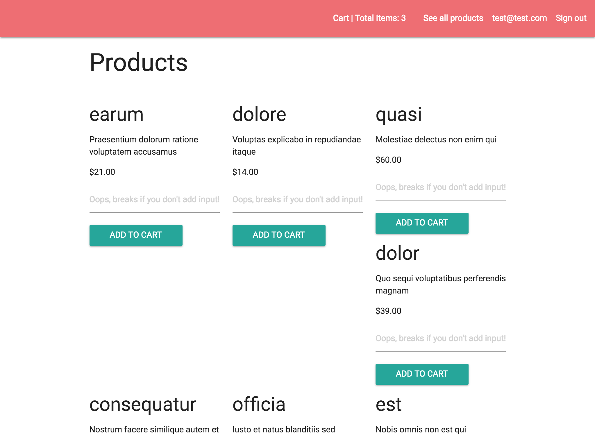

# Epizon
### Ecommerce site allowing users to create accounts, build carts, and check out
### Steven Galvin, July 14th, 2017

This is a website for the fictional ecommerce site, Epizon. I made this using Ruby on Rails with the help of bcrypt for user authentication and authorization. It has two user accounts, basic and admin. Admin accounts can add products, update products, and delete products, as well as delete any reviews on those products. User accounts can add their own reviews to products, edit their reviews, and delete their reviews. All users will be able to view the stores collection of products. Users can add and remove items to their cart, and finalize their order. Taking payments will be handled by the Stripe gem. Testing will be covered with SimpleCov to make sure at least 90% of my site has been succesfully tested.

## Landing Page:

## Planning

### 1. Configuration/dependencies
  The app will primarily use Ruby on Rails and the SQL database. User authentication is made with the bcrypt gem. AJAX added to increase the UX and Stripe will be used to manage user payments. It was made with what I learned from week 3 of Epicodus' Rails course. Styled with bootstrap and SASS.

  Future plans include:
  * Add pictures with paperclip
  * Hosting the site live
  * Updating the style of the page

### 2. User Stories
  * As a user, I'd like to create an account
  * As a user, I'd like to be able to view all products
  * As a user, I'd like to be able to visit products detail page and leave reviews
  * As a user, I'd like CRUD functionality over reviews I've added
  * As a user, I'd like to add products to my cart and see that reflected by a number in the navbar
  * As a user, I'd like to be able to remove products from my cart without the page refreshing after every removal
  * As a user, I'd like the cart to be cleared and my orders to be displayed after payment has been finalized
  * As an admin, I'd like CRUD functionality over products in the store
  * As an admin, I'd like to be able to delete or edit user reviews I deem inappropriate
  * As an admin, I'd like to be able to see all orders and change their status from processing, shipped, and delivered

### 3. Integration
  * Root component/Index page with signup or signin fields
  * Page to display all products
  * Dynamic product page to display product details and user reviews
  * Cart to display order items
  * Pending orders to display orders users have made

  Stretch Goals:
  * About page for information regarding the company
  * Contact page to reach out to me

### 4. UX/UI
  * Include Bootstrap & SASS
  * AJAX

### 5. Polish
  * Refactor code.
  * Delete unused code.
  * Make README awesome.

## Prerequisites

You will need the following things properly installed on your computer.

* [Git](https://git-scm.com/)
* [Node.js](https://nodejs.org/) (with NPM)
* [Ruby](https://www.ruby-lang.org/en/downloads/)
* [Rails](http://rubyonrails.org/)
* [Postgres](https://www.learnhowtoprogram.com/ruby/ruby-database-basics/installing-postgres-7fb0cff7-a0f5-4b61-a0db-8a928b9f67ef) (here's a good lesson online for setting it up)

## Installation

As of writing this README, these instructions work on MacOS.

* Run `$ git clone <this-repository-url>`
* Then `$ cd epizon`
* Once in the epizon folder, run `bundle install` to install gems, `$ rails db:setup` to setup up the database, and `$ rails s` to run the server. Then visit http://localhost:3000/ to view the app.

## Built With

* Ruby ~> 2.4.1
* Rails ~> 5.1
* SQL
* HTML
* CSS/SASS
* Bootstrap https://getbootstrap.com/
* Jquery https://jquery.com/
* Node
* Bower
* FactoryGirl
* Paperclip
* Bcrypt
* AJAX

## Revisions

This section is for listing the revisions I've made to the previous site. Any refactoring, additional features, or debugging will be recorded here along with my commit history.

#### Style Changes
* choose color pallet to build off of instead of materialize defaults
* add website title to navbar with link to root
* add collapsable menu that opens side nav when clicked
* add welcome message calling user by name for personalable touch
* edit button colors
* make finalize order and item delete buttons
* add flex to products page to organize products cleanly
* add borders and box shadow with default height to products for uniformity

#### AJAX

* add AJAX to updating cart with items so it reflects in the navbar

## Authors

Steven Galvin

## License

MIT License

Copyright (c) Steven Galvin, 2017

Permission is hereby granted, free of charge, to any person obtaining a copy
of this software and associated documentation files (the "Software"), to deal
in the Software without restriction, including without limitation the rights
to use, copy, modify, merge, publish, distribute, sublicense, and/or sell
copies of the Software, and to permit persons to whom the Software is furnished to do so, subject to the following conditions:

The above copyright notice and this permission notice shall be included in all
copies or substantial portions of the Software.

THE SOFTWARE IS PROVIDED "AS IS", WITHOUT WARRANTY OF ANY KIND, EXPRESS OR
IMPLIED, INCLUDING BUT NOT LIMITED TO THE WARRANTIES OF MERCHANTABILITY,
FITNESS FOR A PARTICULAR PURPOSE AND NONINFRINGEMENT. IN NO EVENT SHALL THE
AUTHORS OR COPYRIGHT HOLDERS BE LIABLE FOR ANY CLAIM, DAMAGES OR OTHER
LIABILITY, WHETHER IN AN ACTION OF CONTRACT, TORT OR OTHERWISE, ARISING FROM,
OUT OF OR IN CONNECTION WITH THE SOFTWARE OR THE USE OR OTHER DEALINGS IN THE
SOFTWARE.
